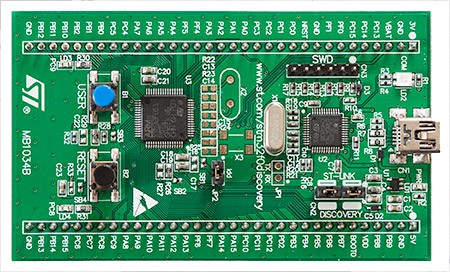
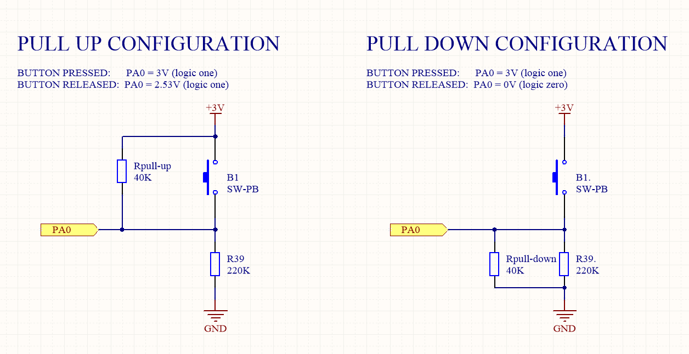

# STM32 course (updating nowadays)
"***Sins are a holy thing!***" - someone said.

**A course on working with hardware and interaction at the lowest level. Without any libraries. Only registers, C, assembler and nothing else.**
## Content:
- [Configuration](#configuration)
- [How to build and upload](#how-to-build-and-upload)
- [Finished works](#finished-works)
- [Library of different schemes](#library-of-different-schemes)
## Configuration
<p align="center">
 	<b>stm32f0xx (STM32F051)</b>    
 </p>

<p align="center">
	
<p>

>[Back to Content](#content)

## How to build and upload
`make qemu` - *necessary in the first work ''_01_blinkled_''

`make QEMU=1`

`sudo make flash`

- - -

 ** if you use WSL on Windows you should install ''**usbipd**'' to connect ST-Link devices.
 
 <p align="center">
 	<b>WINDOWS TERMINAL</b>    
 </p>

```
usbipd wsl list
usbipd wsl attach --busid={num of your port}
usbipd wsl detach --busid={num of your port}
```

>[Back to Content](#content)

## Finished works

* [`01_blinkled`](#) 
	* Emulation of alternating ignition of diodes on STM32 using QEMU on linux.
* [`02_gpio`](#)
	* The game - "finger".
	* Hysteresis - step system for buttons.
* [`03_systick`](#)
	* Testing the interrupt circuit for diodes..
* [`03_gpio_systick`](#) - Interrupts coming soon...
	* Added interrupts for "finger" (from `02_gpio`)  
>[Back to Content](#content)

## Library of different schemes

### 02_gpio


>[Back to `02_gpio`](#)

---

>[Back to Content](#content)

## ©Copyright
<p align="center">
	
	
<p>
